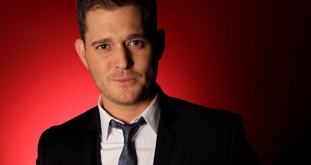

## ONE OF THE GREATEST POP ARTISTS
## Rihanna
<picture>   
    
</picture>
Robyn Rihanna Fenty (born February 20, 1988) is a Barbadian singer, businesswoman and actress. Regarded as a pop icon and one of the most influential contemporary recording artists, Rihanna is known for embracing versatile musical styles and reinventing her image throughout her career.
 
[Instagram](https://www.instagram.com/badgalriri/) 
[Spotify](https://open.spotify.com/artist/5pKCCKE2ajJHZ9KAiaK11H) 
### Rihanna - Diamonds  
<audio controls><source src="assets/images/rihannasong.mp3" type="audio/mpeg"></audio> 

## Michael Bublé
<picture>   
    
</picture>
Michael Steven Bublé (born September 9, 1975) is a Canadian singer, songwriter, actor and record producer. His first album reached the top ten in Canada and the UK. He found a worldwide audience with his 2005 album It's Time as well as his 2007 album Call Me Irresponsible – which reached number one on the Canadian Albums Chart, the UK Albums Chart, the US Billboard 200, the Australian ARIA Albums Chart and several European charts. 
 
[Instagram](https://www.instagram.com/michaelbuble/) 
[Spotify](https://open.spotify.com/artist/1GxkXlMwML1oSg5eLPiAz3) 

## Michael Jackson
<picture>   
    
</picture>
Michael Joseph Jackson (August 29, 1958 – June 25, 2009) was an American singer, songwriter, and dancer. Dubbed the "King of Pop", he is widely regarded as one of the most significant cultural figures of the 20th century and one of the greatest entertainers of all time. He was also known for his unorthodox lifestyle, residing in a private amusement park he called Neverland Ranch, and often becoming the focus of tabloid scrutiny. Jackson's contributions to music, dance, and fashion, along with his publicized personal life, made him a global figure in popular culture for over four decades.
 
[Instagram](https://www.instagram.com/michaeljackson/) 
[Spotify](https://open.spotify.com/artist/3fMbdgg4jU18AjLCKBhRSm) 
### Michael Jackson - Don’t Stop 'Til You Get Enough  
<audio src="assets/images/michaeljacksonsong.mp3" controls></audio> 
 